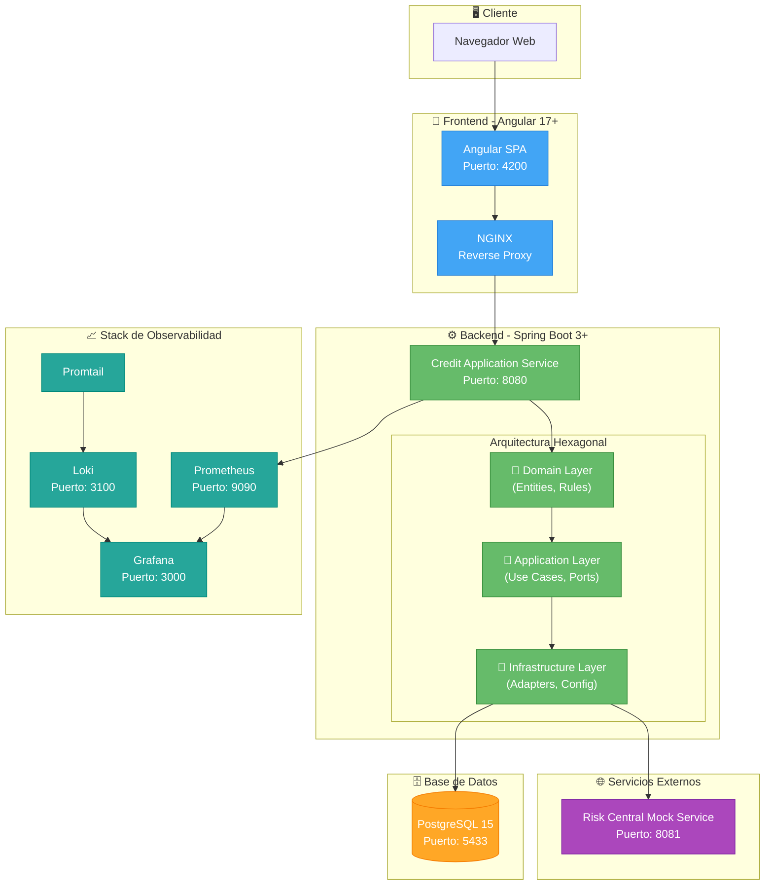
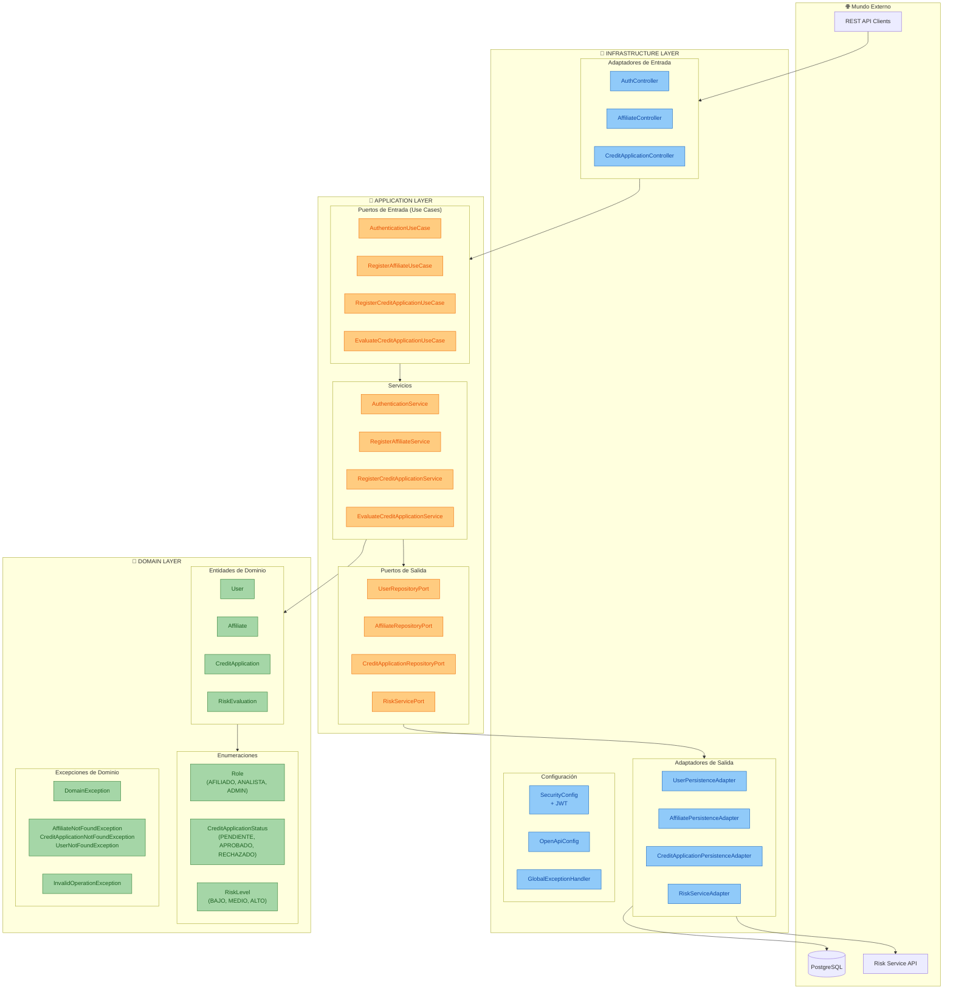
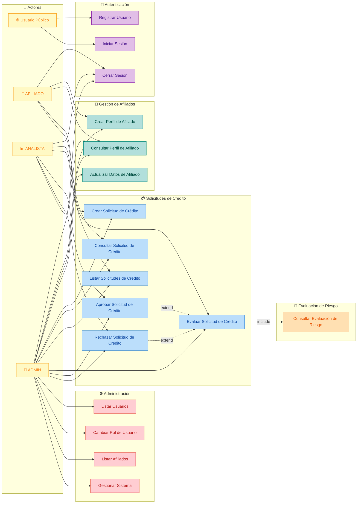
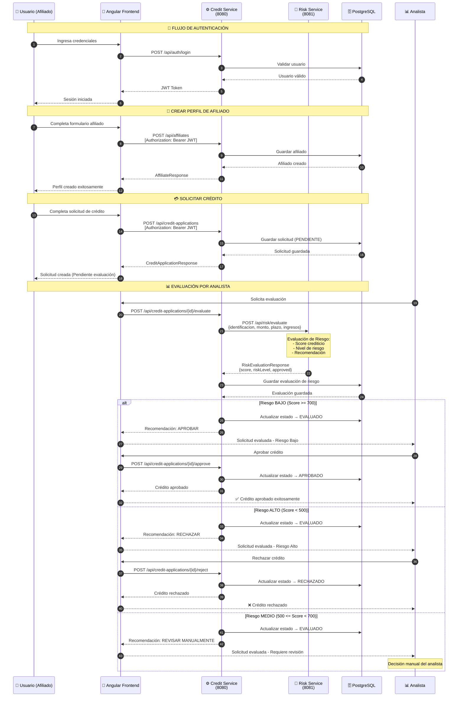
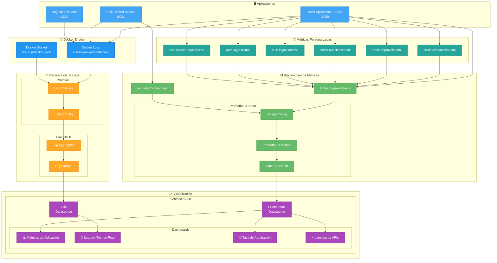
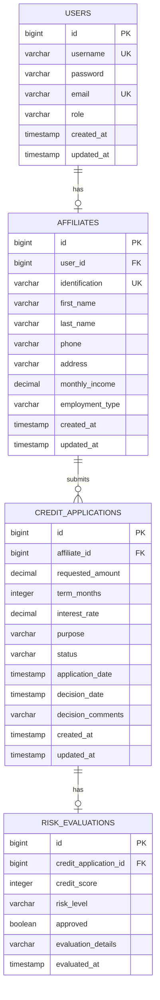
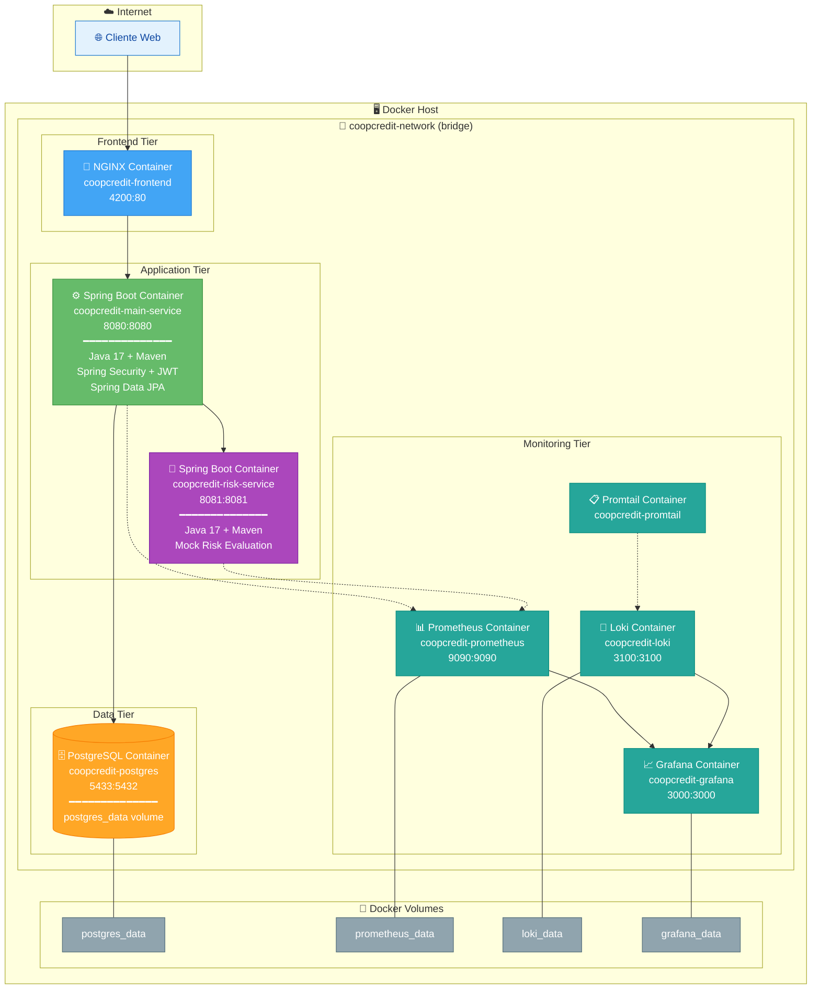

# CoopCredit - Diagramas del Sistema

Este documento contiene los diagramas del sistema CoopCredit utilizando Mermaid.

## 📊 Índice

1. [Diagrama de Arquitectura General](#1-diagrama-de-arquitectura-general)
2. [Diagrama de Arquitectura Hexagonal](#2-diagrama-de-arquitectura-hexagonal)
3. [Diagrama de Casos de Uso](#3-diagrama-de-casos-de-uso)
4. [Diagrama de Relación entre Microservicios](#4-diagrama-de-relación-entre-microservicios)
5. [Diagrama de Flujo de Solicitud de Crédito](#5-diagrama-de-flujo-de-solicitud-de-crédito)
6. [Diagrama de Componentes del Stack de Observabilidad](#6-diagrama-de-componentes-del-stack-de-observabilidad)

---

## 1. Diagrama de Arquitectura General

---

## 2. Diagrama de Arquitectura Hexagonal

---

## 3. Diagrama de Casos de Uso

---

## 4. Diagrama de Relación entre Microservicios

```mermaid
flowchart TB
    subgraph Docker["🐳 Docker Compose Network: coopcredit-network"]
        
        subgraph FrontendContainer["📱 Frontend Container"]
            FE["coopcredit-frontend<br/>Angular + NGINX<br/>Puerto: 4200 → 80"]
        end
        
        subgraph MainServiceContainer["⚙️ Main Service Container"]
            MS["coopcredit-main-service<br/>Spring Boot 3+<br/>Puerto: 8080"]
            
            subgraph Endpoints["API Endpoints"]
                E1["/api/auth/**"]
                E2["/api/affiliates/**"]
                E3["/api/credit-applications/**"]
                E4["/actuator/**"]
            end
        end
        
        subgraph RiskServiceContainer["🎯 Risk Service Container"]
            RS["coopcredit-risk-service<br/>Spring Boot 3+<br/>Puerto: 8081"]
            
            subgraph RiskEndpoints["Risk API"]
                RE1["POST /api/risk/evaluate"]
            end
        end
        
        subgraph DatabaseContainer["🗄️ Database Container"]
            DB[("coopcredit-postgres<br/>PostgreSQL 15<br/>Puerto: 5433 → 5432")]
        end
        
        subgraph ObservabilityStack["📈 Observability Stack"]
            PROM["coopcredit-prometheus<br/>Puerto: 9090"]
            LOKI["coopcredit-loki<br/>Puerto: 3100"]
            PTAIL["coopcredit-promtail"]
            GRAF["coopcredit-grafana<br/>Puerto: 3000"]
        end
    end

    %% Flujo de datos principal
    FE -->|"HTTP/REST<br/>API Calls"| MS
    MS -->|"HTTP/REST<br/>Risk Evaluation"| RS
    MS -->|"JDBC<br/>Persistence"| DB
    
    %% Dependencias de inicio
    MS -.->|"depends_on<br/>service_healthy"| DB
    MS -.->|"depends_on<br/>service_healthy"| RS
    FE -.->|"depends_on<br/>service_healthy"| MS
    
    %% Observabilidad
    MS -->|"Metrics<br/>/actuator/prometheus"| PROM
    RS -->|"Metrics<br/>/actuator/prometheus"| PROM
    
    PTAIL -->|"Docker Logs"| LOKI
    
    PROM -->|"Datasource"| GRAF
    LOKI -->|"Datasource"| GRAF
    PTAIL -.->|"depends_on"| LOKI
    GRAF -.->|"depends_on"| PROM
    GRAF -.->|"depends_on"| LOKI

    classDef frontend fill:#42a5f5,stroke:#1976d2,color:white
    classDef backend fill:#66bb6a,stroke:#388e3c,color:white
    classDef risk fill:#ab47bc,stroke:#7b1fa2,color:white
    classDef database fill:#ffa726,stroke:#f57c00,color:white
    classDef monitoring fill:#26a69a,stroke:#00897b,color:white

    class FE frontend
    class MS,E1,E2,E3,E4 backend
    class RS,RE1 risk
    class DB database
    class PROM,LOKI,PTAIL,GRAF monitoring
```

---

## 5. Diagrama de Flujo de Solicitud de Crédito

---

## 6. Diagrama de Componentes del Stack de Observabilidad

---

## 7. Diagrama de Entidad-Relación (Base de Datos)

---

## 8. Diagrama de Despliegue

---

## 📖 Cómo Visualizar estos Diagramas

### Opción 1: GitHub/GitLab
Simplemente sube este archivo a tu repositorio. GitHub y GitLab renderizan automáticamente los diagramas Mermaid.

### Opción 2: VS Code
Instala la extensión "Markdown Preview Mermaid Support" para visualizar los diagramas directamente en VS Code.

### Opción 3: Mermaid Live Editor
Visita [mermaid.live](https://mermaid.live) y pega el código de cualquier diagrama para editarlo y exportarlo.

### Opción 4: Documentación
Herramientas como Docusaurus, MkDocs o Confluence soportan Mermaid de forma nativa o mediante plugins.

---

**CoopCredit** - Sistema de Gestión de Créditos © 2025
